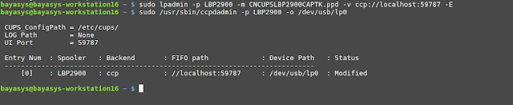
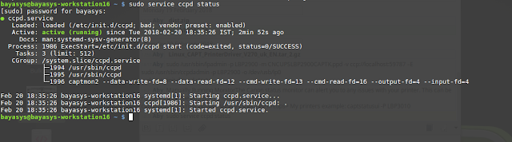
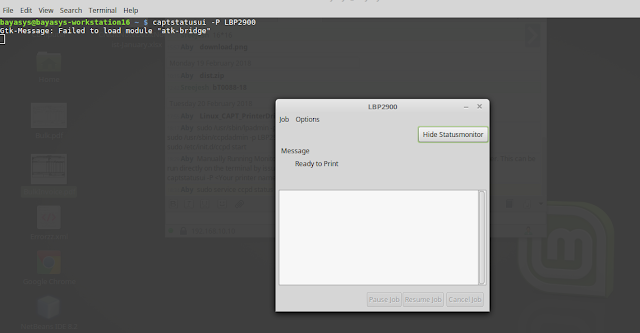
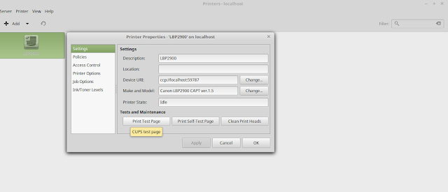
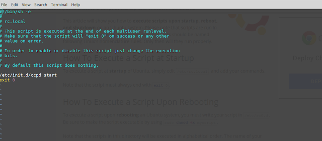

#  How to install Canon LBP2900B printer in Linux
 ***Steps:*** 
    


1. Download Canon LBP2900B Printer driver for Linux 

    https://drive.google.com/drive/folders/1XlPd70yXfJBJU8qhVzac2xIzpXGL3bOL?usp=sharing

    Form Canon official website: http://support-in.canon-asia.com/contents/IN/EN/0100459601.html

2. Install CAPT Printer Driver. There will be two packages

    -cndrvcups-common_3.21-1_i386  
    -cndrvcups-capt_2.71-1_i386

    ```bash
    sudo dpkg -i cndrvcups-common_3.21-1_i386.deb

    sudo dpkg -i cndrvcups-capt_2.71-1_i386.deb
    ```
3. Restart the printer service
    ```bash
    service cups restart
    ```
4. Add Printer using the following commands
    ```bash
    sudo lpadmin -p LBP2900 -m CNCUPSLBP2900CAPTK.ppd -v ccp://localhost:59787 –E
    sudo ccpdadmin -p LBP2900 -o /dev/usb/lp0
    sudo /etc/init.d/ccpd start
    ```

    

5. Verify Printer Status

    Now restart your system and run the following command to check the status
    ```bash
    sudo service ccpd status
    ```

    

6. Monitor printer status

    The Canon status monitor can alert you to any issues with your printer. This can be done by running  following command on the terminal

    ```bash
    captstatusui -P LBP2900
    ```
    Note: If any error while issuing the above command, Please install the following packages
    ```bash
    sudo apt-get install libatk-adaptor libgail-common
    ```
    


7. Test your Printer


    

8. Auto startup setting procedure for ccpd daemon

    When setting the Status Monitor to start automatically, ccpd daemon must be set to start automatically as well.

    Set ccpd daemon to start automatically in the following procedure.

    <For a distribution with a /etc/rc.local file>
    Log in as 'root' and add the '/etc/init.d/ccpd start' command to the /etc/rc.local file.

    