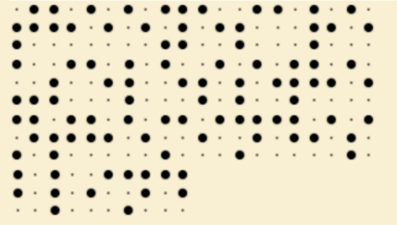
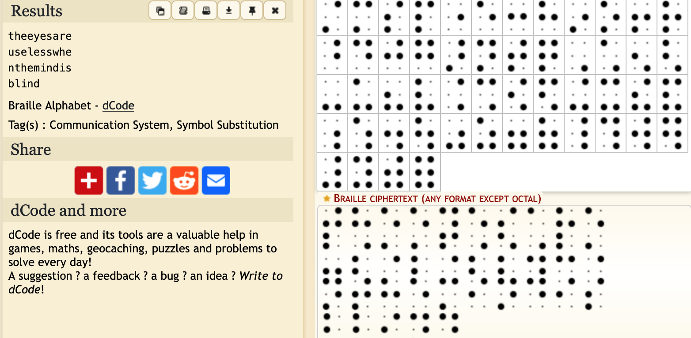

# dots-cryptography-cipher
cybergonctf2023

We are given an image with dots. Using Dcode, we can see that it is a representation of the Braille symbols.

https://www.dcode.fr/braille-alphabet

## Flag: CybergonCTF{the_eyes_are_useless_when_the_mind_is_blind}
